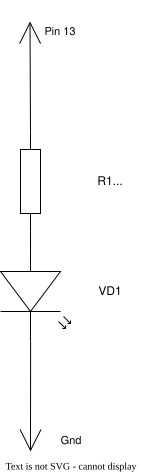

# Мигающий светодиод на Arduino Leonardo

Давай научимся управлять светодиодом! В этом уроке мы научим Arduino включать и выключать лампочку.

## Что нам понадобится

- Arduino Leonardo
- USB кабель
- Компьютер с установленным PlatformIO

## Урок: Как это работает

### Шаг 1: Подготовка платы

Когда компьютер запускает программу на Arduino, сначала вызывается функция `setup()` — это происходит один раз.

В `setup()` мы говорим Arduino: "Слушай, пин 13 — это выход для светодиода!"

```cpp
void setup() {
  pinMode(ledPin, OUTPUT);
}
```

### Шаг 2: Основной цикл

После `setup()` Arduino снова и снова выполняет функцию `loop()` — вот здесь происходит волшебство!

```cpp
void loop() {
  turnLedOn();      // Включаем светодиод
  delay(1000);      // Ждём 1000 миллисекунд (1 секунда)
  turnLedOff();     // Выключаем светодиод
  delay(1000);      // Ждём ещё 1 секунду
}
```

**Что здесь происходит:**
1. Светодиод включается (загорается)
2. Ждём 1 секунду
3. Светодиод выключается (гаснет)
4. Ждём ещё 1 секунду
5. Всё повторяется с начала!

### Шаг 3: Вспомогательные функции

Мы создали две вспомогательные функции чтобы код был понятнее:

```cpp
void turnLedOn() {
  digitalWrite(ledPin, HIGH);   // HIGH = включить
}

void turnLedOff() {
  digitalWrite(ledPin, LOW);    // LOW = выключить
}
```

## Запуск программы

### 1. Подключи Arduino к компьютеру через USB

### 2. Открой терминал (командную строку) и введи:
```bash
platformio run --target upload
```

### 3. Смотри, как мигает светодиод! 💡

## Экспериментируй!

Попробуй изменить числа в `delay()`:
- `delay(500)` — светодиод будет мигать быстрее
- `delay(2000)` — светодиод будет мигать медленнее

Например:
```cpp
void loop() {
  turnLedOn();
  delay(500);       // Быстро!
  turnLedOff();
  delay(500);
}
```

Или сделай разное время включения и выключения:
```cpp
void loop() {
  turnLedOn();
  delay(200);       // Быстро включится
  turnLedOff();
  delay(1000);      // Долго будет отключен
}
```

## Собери свою схему!

Вот так подключается светодиод к Arduino Leonardo:



**Что нужно:**
- 1 светодиод (любого цвета)
- 1 резистор 220 Ом
- 2 провода

Для сборки схемы ты можешь использовать:
- конструктор «Знаток»;
- макетную плату;
- шилд для прототипов.

**Как собрать:**
1. Вставь резистор в макетную плату между пином 13 Arduino и одной ноги светодиода
2. Вторую ногу светодиода подключи к GND (земле) Arduino
3. Загрузи программу на Arduino
4. Смотри, как мигает твой светодиод! 🔌

## Словарик

- **Arduino** — маленький компьютер, который управляет электроникой
- **Пин** — "ножка" на Arduino, через которую подаётся сигнал
- **digitalWrite** — команда "передай сигнал на пин"
- **HIGH** — "включить" (подать напряжение)
- **LOW** — "выключить" (убрать напряжение)
- **delay(1000)** — "подожди 1000 миллисекунд" (1 секунда)
- **setup()** — функция, которая запускается один раз в начале
- **loop()** — функция, которая повторяется снова и снова
- **макетная плата** — панель с отверстиями для сборки электронных схем без пайки
- **шилд** — плата расширения для Arduino
