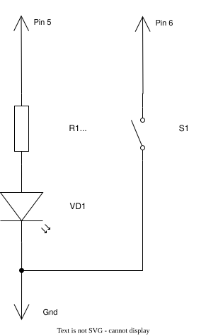

# Управление светодиодом кнопкой на Arduino Leonardo

Давай научимся управлять светодиодом с помощью кнопки! В этом уроке мы научим Arduino включать светодиод при нажатии кнопки и выключать его при отпускании.

## Что нам понадобится

- Arduino Leonardo
- USB кабель
- Компьютер с установленным PlatformIO
- 1 светодиод (любого цвета)
- 1 резистор 220 Ом (для светодиода)
- 1 кнопка (обычная кнопка без фиксации)
- 3 провода

## Собери свою схему!

Сначала собери схему на макетной плате, а потом будем программировать!

Вот так подключается кнопка и светодиод к Arduino Leonardo:



**Что нужно:**
- 1 светодиод (любого цвета)
- 1 резистор 220 Ом (для светодиода)
- 1 кнопка
- 3 провода

**Как собрать:**
1. Подключи один провод от пина 6 Arduino к одной ноге кнопки
2. Подключи второй провод от другой ноги кнопки к GND (земле) Arduino
3. Вставь резистор 220 Ом между пином 5 Arduino и одной ноги светодиода
4. Вторую ногу светодиода подключи к GND (земле) Arduino
5. Готово! Теперь подключи Arduino к компьютеру через USB 🔌

**Важно:** В коде мы включим режим `INPUT_PULLUP` для пина 6. Это значит, что Arduino сама создаст "виртуальный резистор" внутри себя, который "держит" пин на HIGH (1), пока кнопка не нажата. Когда ты нажимаешь кнопку, она замыкает пин на GND и пин становится LOW (0). Дополнительный резистор на макетной плате не нужен!

## Этап 1: Кнопка управляет светодиодом

### Что здесь происходит

Когда ты нажимаешь кнопку — светодиод загорается. Когда отпускаешь кнопку — светодиод гаснет.

### Как реализовать

#### Шаг 1: Напиши `setup()`

В функции `setup()` подготовь пины:

```cpp
void setup() {
    pinMode(buttonPin, INPUT_PULLUP);
    pinMode(ledPin, OUTPUT);
}
```

#### Шаг 2: Напиши `buttonIsDown()`

Эта функция должна вернуть `true`, если кнопка нажата (пин имеет значение LOW):

```cpp
bool buttonIsDown() {
    return digitalRead(buttonPin) == LOW;
}
```

#### Шаг 3: Напиши `buttonIsUp()`

Эта функция должна вернуть `true`, если кнопка отпущена (пин имеет значение HIGH):

```cpp
bool buttonIsUp() {
    return digitalRead(buttonPin) == HIGH;
}
```

#### Шаг 4: Напиши `turnLightOn()`

Эта функция должна включить светодиод и обновить переменную состояния:

```cpp
void turnLightOn() {
    digitalWrite(ledPin, HIGH);
    lightState = true;
}
```

#### Шаг 5: Напиши `turnLightOff()`

Эта функция должна выключить светодиод и обновить переменную состояния:

```cpp
void turnLightOff() {
    digitalWrite(ledPin, LOW);
    lightState = false;
}
```

#### Шаг 6: Напиши `lightIsOn()`

Эта функция должна вернуть `true`, если светодиод включён:

```cpp
bool lightIsOn() {
    return lightState == true;
}
```

#### Шаг 7: Напиши `lightIsOff()`

Эта функция должна вернуть `true`, если светодиод выключен:

```cpp
bool lightIsOff() {
    return lightState == false;
}
```

#### Шаг 8: Напиши `loop()`

В основном цикле используй логику: если кнопка нажата и свет ещё не горит — включи. Если кнопка отпущена и свет ещё горит — выключи:

```cpp
void loop() {
    if (buttonIsDown() && lightIsOff()) {
        turnLightOn();
    }

    if (buttonIsUp() && lightIsOn()) {
        turnLightOff();
    }
}
```

### Запуск программы этапа 1

Открой терминал и введи:
```bash
platformio run --target upload
```

Нажимай кнопку и смотри, как светодиод реагирует на нажатие! 💡

## Этап 2: Выключатель (toggle)

### Что здесь происходит

При первом нажатии кнопки светодиод загорается. При втором нажатии — гаснет. И так каждый раз!

### Как реализовать

#### Шаг 1: Напиши `buttonWasPressed()`

Эта функция должна обнаружить **новое** нажатие кнопки — когда она только что переключилась с отпущенной на нажатую:

```cpp
bool buttonWasPressed() {
    bool currentButtonState = digitalRead(buttonPin);
    
    if (currentButtonState == LOW && lastButtonState == HIGH) {
        // Кнопка только что была нажата!
        lastButtonState = currentButtonState;
        return true;
    }
    
    lastButtonState = currentButtonState;
    return false;
}
```

**Как это работает:**
- `currentButtonState` — состояние кнопки прямо сейчас
- `lastButtonState` — состояние кнопки в прошлом цикле
- Если текущее = LOW (нажата) И прошлое = HIGH (была отпущена) → это новое нажатие!
- Обновляем `lastButtonState` для следующего цикла

#### Шаг 2: Напиши `toggleLight()`

Эта функция переключает светодиод — если был включён, выключи; если выключен, включи:

```cpp
void toggleLight() {
    if (lightIsOn()) {
        turnLightOff();
    } else {
        turnLightOn();
    }
}
```

#### Шаг 3: Напиши `loop()` для Этапа 2

В основном цикле просто проверяй: если кнопка была нажата, переключи свет:

```cpp
void loop() {
    if (buttonWasPressed()) {
        toggleLight();
    }
}
```

### Запуск программы этапа 2

Открой терминал и введи:
```bash
platformio run --target upload
```

Нажимай кнопку — светодиод будет переключаться! 🔦

## Этап 3: Мигающий светодиод с выключателем

### Что здесь происходит

Первое нажатие кнопки включит светодиод и он начнёт мигать. Второе нажатие выключит мигание и светодиод полностью погаснет. И так каждый раз!

### Как реализовать

#### Шаг 1: Добавь переменные

Сначала добавь новые переменные в начало файла:

```cpp
bool isBlinking = false;  // Включено ли мигание?
unsigned long lastBlinkTime = 0;  // Когда светодиод последний раз переключался?
const unsigned long blinkInterval = 500;  // Интервал мигания в миллисекундах (500 = полусекунды)
```

#### Шаг 2: Напиши `loop()`

Вот как работает основной цикл:

```cpp
void loop() {
    if (buttonWasPressed()) {
        toggleBlinking();
    }

    if (isBlinking && blinkIntervalElapsed()) {
        toggleLight();
        resetBlinkInterval();
    }
}
```

**Что здесь происходит:**

Программа делает две простые проверки каждый раз:

1. **Первая проверка:** «Нажал ли я кнопку?»
   - Если ДА → вызови `toggleBlinking()` (она сама разберётся, включить или выключить мигание)

2. **Вторая проверка:** «Мигание включено И прошло полсекунды?»
   - Если ДА → переключи светодиод (если он горел, погаси его; если был потухшим, зажги его) и снова обнули счётчик

Вот и всё! Кнопка вызывает `toggleBlinking()`, а часы внутри Arduino считают полсекунды и переключают светодиод снова и снова!

#### Шаг 3: Напиши `toggleBlinking()`

Эта функция переключает режим мигания. Если мигание было включено — выключи светодиод. Если было выключено — обнули счётчик, зажги светодиод и включи мигание:

```cpp
void toggleBlinking() {
    if (isBlinking) {
        isBlinking = false;
        turnLightOff();
    } else {
        resetBlinkInterval();
        isBlinking = true;
        turnLightOn();
    }
}
```

#### Шаг 4: Напиши `resetBlinkInterval()`

Эта функция сбрасывает счётчик времени. Вызывай её каждый раз, когда переключаешь светодиод:

```cpp
void resetBlinkInterval() {
    lastBlinkTime = millis();
}
```

**Что такое `millis()`?**

`millis()` возвращает количество миллисекунд, прошедших с момента запуска Arduino. Мы используем её, чтобы отсчитывать время между переключениями светодиода.

#### Шаг 5: Напиши `blinkIntervalElapsed()`

Эта функция проверяет: прошло ли достаточно времени, чтобы переключить светодиод? Возвращает `true`, если интервал истёк:

```cpp
bool blinkIntervalElapsed() {
    return millis() - lastBlinkTime >= blinkInterval;
}
```

**Как это работает:**
- `millis()` — текущее время
- `lastBlinkTime` — время последнего переключения
- Если разница >= `blinkInterval` (500 миллисекунд) → пора переключать!

### Запуск программы этапа 3

Открой терминал и введи:
```bash
platformio run --target upload
```

Нажимай кнопку — светодиод будет мигать! 💫

## Словарик

- **Arduino** — маленький компьютер, который управляет электроникой
- **Пин** — "ножка" на Arduino, через которую подаётся сигнал
- **INPUT** — режим, когда пин принимает сигналы (вход)
- **INPUT_PULLUP** — режим, когда пин принимает сигналы и использует встроенный pull-up резистор (вход с защитой)
- **OUTPUT** — режим, когда пин выдаёт сигналы (выход)
- **digitalWrite** — команда "передай сигнал на пин"
- **digitalRead** — команда "прочитай сигнал с пина"
- **HIGH** — "включить" (подать напряжение / кнопка не нажата)
- **LOW** — "выключить" (убрать напряжение / кнопка нажата)
- **setup()** — функция, которая запускается один раз в начале
- **loop()** — функция, которая повторяется снова и снова
- **millis()** — функция, которая возвращает количество миллисекунд с момента запуска Arduino
- **макетная плата** — панель с отверстиями для сборки электронных схем без пайки
- **Pull-up резистор** — резистор, который "держит" пин на уровне HIGH, пока кнопка не нажата (встроенный в Arduino режим INPUT_PULLUP)
- **Мигание** — циклическое включение и выключение светодиода через определённый интервал времени
