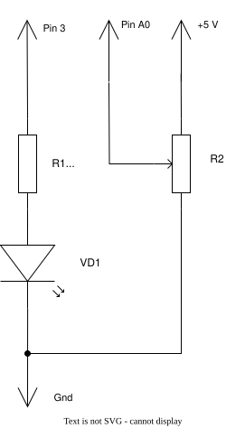

# 03. Регулируем яркость светодиода

## Что получится в результате? 🎯

Светодиод будет светиться с разной яркостью: от полного выключения до максимального свечения. Яркость будешь регулировать **переменным резистором** (ползунком) из конструктора "Знаток" — двигаешь ползунок, яркость меняется! 💡

---

## Собираем схему 🔌



Используй конструктор "Знаток" и соедини компоненты по схеме:

| Компонент | Пин Arduino |
|-----------|-----------|
| Светодиод (VD1) | Pin 3 (через резистор R1 на 1 кОм) |
| Переменный резистор (R2) | Pin A0 |
| Питание (+5V) | +5V на Arduino |

**Что нужно подключить:**
1. Один конец переменного резистора к **+5V** (питание)
2. Средний контакт резистора к **Pin A0** (читаем значение)
3. Другой конец резистора к **GND** (земля)
4. Светодиод через резистор 1 кОм к **Pin 3** (управляем яркостью)
5. Минус светодиода (короткая ножка) к **GND**

---

## Что такое класс? 🎮

Представь, что класс — это **пульт управления для игрушки**. 

- **Пульт** (класс) хранит в себе все кнопки и информацию (данные)
- **Кнопки пульта** (методы) — это команды, которые ты отправляешь игрушке ("Включись!", "Стань ярче!")
- **Каждый раз**, когда нажимаешь кнопку, игрушка выполняет команду

В нашем проекте два класса:
- `DimmableLed` — пульт для светодиода ("Стань такой яркости!")
- `Potentiometer` — пульт для ползунка ("Скажи мне, где ты сейчас?")

Программа **общается** между классами: просит у ползунка его положение, а потом говорит светодиоду, какой яркости он должен быть.

---

## Как работает программа? 📋

Вот что происходит в `loop()`:

```cpp
void loop() {
    // 1. Спрашиваем ползунок: "Где ты сейчас? Какое значение?"
    int brightness = pot.getPosition();
    
    // 2. Отправляем это значение светодиоду: "Стань такой яркости!"
    led.setBrightness(brightness);
}
```

Это повторяется снова и снова. Пока ты двигаешь ползунок, программа спрашивает его положение и сообщает светодиоду новую яркость! ⚡

**Архитектура программы:**
1. `pot.getPosition()` — ползунок "говорит", какое значение на нём сейчас (от 0 до 255)
2. `led.setBrightness(brightness)` — светодиод получает это значение и светит нужной яркостью
3. `loop()` повторяется много раз в секунду, поэтому яркость обновляется быстро и плавно

---

## Пошаговая реализация 🔧

### Шаг 1: Заполни loop() — организуй взаимодействие между классами

Это самый важный шаг! Здесь видно, как два класса работают вместе.

Вот что должно быть в `loop()`:

```cpp
void loop() {
    // Спрашиваем ползунок: "Где ты сейчас?"
    // getPosition() вернёт число от 0 до 255 в зависимости от положения ползунка
    int brightness = pot.getPosition();
    
    // Отправляем это число светодиоду: "Стань такой яркости!"
    led.setBrightness(brightness);
}
```

Замени пустое содержимое `loop()` на этот код.

---

### Шаг 2: Potentiometer — getPosition()

Класс `Potentiometer` должен читать положение ползунка и переводить его в диапазон яркости (0–255).

**Что нужно сделать?**
- Прочитать аналоговое значение с пина (функция `analogRead()` вернёт число от 0 до 1023)
- Перевести это число из диапазона 0–1023 в диапазон от `minValue` до `maxValue` (функция `map()`)

**Реализация:**

```cpp
int getPosition() {
    int rawValue = analogRead(pin);
    int scaledValue = map(rawValue, 0, 1023, minValue, maxValue);
    return scaledValue;
}
```

Замени TODO в методе `getPosition()` на этот код.

**Как это работает?**
- `analogRead(pin)` читает положение ползунка и возвращает число от 0 до 1023
- `map(rawValue, 0, 1023, minValue, maxValue)` переводит это число в нужный диапазон
  - Например, если ползунок в середине (значение ~512), `map()` превратит это в ~127
  - Если ползунок в конце (значение 1023), `map()` превратит это в 255 (максимальная яркость)

---

### Шаг 3: DimmableLed — setBrightness()

Это основной метод светодиода! Он получает число яркости (от 0 до 255) и отправляет его на пин через функцию `analogWrite()`.

**Что делает `analogWrite(pin, value)`?**
- `analogWrite()` отправляет на пин сигнал с переменной мощностью (PWM)
- Значение от 0 до 255 определяет яркость:
  - `0` — светодиод выключен (0% яркости)
  - `255` — светодиод горит максимально (100% яркости)
  - `127` — примерно половина яркости (50%)

**Реализация:**

```cpp
void setBrightness(int brightness) {
    currentBrightness = brightness;
    analogWrite(pin, brightness);
}
```

Замени TODO в методе `setBrightness()` на этот код.

---

## Запуск программы 🚀

Убедись, что:
1. Оба метода класса `Potentiometer` и `DimmableLed` заполнены (TODO должны исчезнуть)
2. `loop()` содержит нужный код
3. Схема собрана правильно (смотри раздел "Собираем схему")

Загрузи программу:
```bash
platformio run --target upload
```

**Ожидаемый результат:**
- Светодиод включится
- Когда ты двигаешь ползунок переменного резистора влево и вправо, яркость светодиода плавно меняется от полного выключения до максимального свечения
- При движении ползунка в одну сторону — яркость увеличивается, в другую — уменьшается
- Реагирует быстро и плавно! ⚡

---

## Экспериментируй! 🧪

1. **Изменяй диапазон в конструкторе Potentiometer:**
   - Когда создаёшь объект `pot`, сейчас там написано `Potentiometer(potentiometerPin, 0, 255)`
   - Попробуй изменить на `Potentiometer(potentiometerPin, 100, 200)`
   - Результат: светодиод не будет полностью выключаться и не будет светить максимально, яркость будет только в диапазоне 100–200

2. **Добавь методы on() и off():**
   - Напиши в классе `DimmableLed` два новых метода:
     - `void on() { setBrightness(255); }` — включить на полную яркость
     - `void off() { setBrightness(0); }` — выключить
   - Теперь сможешь управлять светодиодом не только плавно, но и включать/выключать его полностью

3. **Комбинируй ползунок и кнопку:**
   - Добавь кнопку (как в уроке "Button")
   - Пока кнопка не нажата — работает регулировка яркости ползунком
   - Когда кнопка нажата — светодиод включается на максимум

---

## Словарик 📖

**Класс** — шаблон, по которому создаются объекты. Класс хранит данные и методы (действия), которые можно с этими данными делать. Пример: класс `DimmableLed` описывает, как работает управляемый светодиод.

**Объект** — конкретная "копия" класса. Например, `led` — это объект класса `DimmableLed`. Из одного класса можно создать много разных объектов.

**Метод** — функция, которая живёт внутри класса и работает с его данными. Примеры: `setBrightness()`, `getPosition()`.

**Конструктор** — специальный метод, который запускается один раз, когда мы создаём объект. В нашем случае конструктор класса `DimmableLed` подготавливает пин, а конструктор `Potentiometer` запоминает пин и диапазон значений.

**analogRead()** — функция для чтения аналогового значения с пина (например, с переменного резистора). Возвращает число от 0 до 1023.

**analogWrite()** — функция для отправки переменного сигнала на пин (PWM). Принимает значение от 0 до 255. На пин 3 (Leonardo) это работает и меняет яркость светодиода.

**PWM (Pulse Width Modulation)** — способ управления мощностью сигнала через быстрое включение и выключение. Мозг не успевает заметить моргание, а видит плавную яркость. На Leonardo поддерживается на пинах 3, 5, 6, 9, 10, 11, 12, 13.

**Переменный резистор (ползунок)** — компонент из конструктора "Знаток" с ползунком. Когда двигаешь ползунок, его сопротивление меняется, а Arduino читает это как аналоговое значение (0–1023).

**Пин A0** — аналоговый вход на Arduino Leonardo. Используется для чтения значений с датчиков (переменного резистора, светочувствительного датчика и т.д.).

**Pin 3** — цифровой вывод на Arduino Leonardo с поддержкой PWM. Используется для управления яркостью светодиода.

**map()** — функция для перевода числа из одного диапазона в другой. Например, `map(rawValue, 0, 1023, 0, 255)` переводит значение от 0–1023 в 0–255.

**Взаимодействие классов** — когда один класс использует методы другого. В нашем проекте `loop()` спрашивает у `Potentiometer` положение ползунка и передаёт его `DimmableLed`. Так два класса "общаются" и работают вместе.

**GND (земля)** — общая точка схемы, отрицательный полюс питания. Все компоненты должны быть подключены к земле через минус батареи или Arduino.
