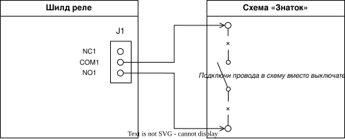

# Включаем схему «Знаток» с помощью реле

В этом опыте Arduino будет работать как автоматический выключатель. Она будет включать питание твоей схемы из конструктора «Знаток» на 10 секунд, потом выключать на 10 секунд — и всё повторится! 🔌🎉

> **Важно: работаем только с батарейным питанием конструктора «Знаток».** Не подключай к реле розетку, лампы 220 В или другие устройства от сети. Для них нужна помощь взрослого и другое оборудование.

## Что нам понадобится

- Arduino Leonardo;
- USB-кабель;
- компьютер с PlatformIO;
- шилд **Relay Shield v1.0 (12/02/2013)** с 4 реле;
- конструктор «Знаток»;
- любая **готовая батарейная** схема из «Знатока» с ручным выключателем;
- 2 провода с зачищенными концами для винтовой клеммы.

## Собери свою схему!

Реле — это выключатель, которым управляет не рука, а Arduino. Мы поставим его **вместо ручного выключателя** в цепи питания схемы «Знаток».



### 1. Установи шилд

1. Отключи Arduino от USB.
2. Аккуратно надень Relay Shield на Arduino Leonardo. Контакты шилда должны войти в соответствующие разъёмы Arduino.
3. На этом шилде вход первого канала уже соединён с цифровым пином **7** Arduino. Дополнительный провод к пину 7 не нужен. 💡

### 2. Подключи питание схемы «Знаток»

1. Собери в «Знатоке» простую схему с батарейным блоком. Например, батарейный блок, лампочка и соединительные провода.
2. Найди два места, к которым был подключён ручной выключатель. Убери выключатель.
3. Подключи один провод от первого места к клемме **COM1** первого реле.
4. Подключи второй провод от второго места к клемме **NO1** первого реле.
5. Осторожно затяни винты клеммы маленькой отвёрткой.

**Почему именно COM1 и NO1?** Когда Arduino включает реле, внутри замыкаются COM1 и NO1 — так же, как если бы ты включил выключатель рукой. Клемму **NC1** в этом опыте не используем.

Перед тем как вставлять батарейки или подключать USB, попроси взрослого проверить соединения. Не касайся оголённых концов проводов, когда схема работает.

## Что такое класс `Relay`? 🎮

В уроке 3 ты уже познакомился с классами. Здесь класс `Relay` — это пульт управления одним реле. Он запоминает пин реле и даёт две понятные команды: `on()` — включить, `off()` — выключить.

Мы создаём пульт для первого канала так:

```cpp
Relay relay(7);
```

Число `7` — цифровой пин Arduino, который управляет первым реле на этом шилде.

## Реле включает и выключает питание

### Что здесь происходит

Arduino отправляет сигнал на первое реле. Реле замыкает цепь питания, и схема «Знаток» начинает работать. Через 10 секунд Arduino размыкает цепь, и схема останавливается. Это похоже на будильник: он отсчитывает время и даёт команду. ⏰

### Как реализовать

#### Шаг 1: Напиши главный план в `loop()`

В `loop()` сначала включи реле, подожди 10 секунд, выключи его и снова подожди 10 секунд:

```cpp
void loop() {
    relay.on();             // Подаём питание на схему «Знаток»
    delay(relayInterval);   // Ждём 10 секунд

    relay.off();            // Отключаем питание
    delay(relayInterval);   // Ждём ещё 10 секунд
}
```

После этого главный план уже понятен: попросить реле включиться, подождать, попросить выключиться, подождать. Arduino будет повторять его снова и снова.

#### Шаг 2: Напиши метод `on()` в классе `Relay`

На нашем шилде реле срабатывает при сигнале `HIGH`. Поэтому в методе `on()` напиши:

```cpp
void on() {
    digitalWrite(pin, HIGH);
}
```

При включении реле часто слышен тихий щелчок. Это нормально: внутри реле срабатывает маленький выключатель.

#### Шаг 3: Напиши метод `off()` в классе `Relay`

Чтобы выключить реле, отправь `LOW` на пин, который класс запомнил в переменной `pin`:

```cpp
void off() {
    digitalWrite(pin, LOW);
}
```

## Запуск программы

1. Сохрани `src/main.cpp`.
2. Подключи Arduino к компьютеру через USB.
3. Открой терминал в папке `04. Relay` и введи:

```bash
platformio run --target upload
```

4. После загрузки подожди: схема «Знаток» включится на 10 секунд, затем выключится на 10 секунд. Слушай щелчки реле и наблюдай за своей схемой! 🎉

Если реле щёлкает, а схема не работает, отключи USB и проверь: один провод должен быть в **COM1**, второй — в **NO1**, а винты должны крепко держать провода.

## Экспериментируй!

Попробуй изменить время в этой строке:

```cpp
const unsigned long relayInterval = 10000;
```

- `5000` — питание будет включаться и выключаться каждые 5 секунд;
- `2000` — каждые 2 секунды.

Не переключай реле слишком быстро: оставляй хотя бы 1 секунду (`1000`), чтобы успеть увидеть результат и услышать щелчок.

## Словарик

- **Arduino** — маленький компьютер, который управляет электроникой.
- **Relay Shield** — плата с четырьмя реле для Arduino.
- **Реле** — выключатель, которым управляет электрический сигнал.
- **Класс** — шаблон, по которому создаются объекты. Класс хранит данные и методы (действия), которые можно выполнять с этими данными. Пример: класс `Relay` описывает, как управлять реле.
- **Объект** — конкретная «копия» класса. Например, `relay` — это объект класса `Relay`. Из одного класса можно создать много разных объектов.
- **Метод** — команда внутри класса. Здесь это `on()` и `off()`.
- **Конструктор** — часть класса, которая готовит объект при его создании.
- **Пин** — контакт Arduino для отправки или чтения сигнала.
- **OUTPUT** — режим пина, когда Arduino отправляет сигнал наружу.
- **LOW** — сигнал «0»; на этом шилде он выключает реле.
- **HIGH** — сигнал «1»; на этом шилде он включает реле.
- **COM** — общий контакт реле.
- **NO** — контакт, который соединяется с COM при включённом реле.
- **NC** — контакт, который соединён с COM, пока реле выключено.
- **`setup()`** — часть программы, которая запускается один раз при старте.
- **`loop()`** — часть программы, которая повторяется, пока Arduino включена.
- **`delay()`** — команда ожидания; число внутри указано в миллисекундах.
- **Миллисекунда** — одна тысячная секунды; 10000 миллисекунд — 10 секунд.
