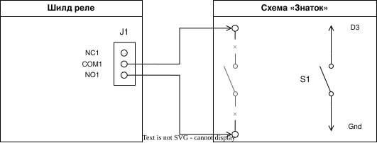

# Реле времени: запускаем таймер кнопкой

В этом уроке мы сделаем первый шаг к настоящему реле времени. Нажмёшь кнопку — реле включит питание батарейной схемы «Знаток» на 10 секунд, а затем выключит его. 🔘⏰

> **Важно:** работаем только с батарейным питанием конструктора «Знаток». Не подключай к реле розетку, лампы на 220 В и другие сетевые устройства.

## Что нам понадобится

- Arduino Leonardo;
- USB-кабель;
- компьютер с PlatformIO;
- шилд **Relay Shield v1.0 (12/02/2013)** с 4 реле;
- кнопка без фиксации;
- 2 провода для подключения кнопки;
- конструктор «Знаток» с батарейной схемой, подключённой через первое реле, как в уроке 04.

## Собери свою схему!

Сначала собери реле и батарейную схему «Знаток» по инструкции из [урока 04](../04.%20Relay/README.md). Используй клеммы **COM1** и **NO1** первого реле.

Теперь добавь кнопку:

1. Подключи один контакт кнопки к цифровому пину **D3** Arduino.
2. Подключи второй контакт кнопки к **GND** Arduino.
3. Реле первого канала шилда остаётся подключённым к пину **D7**.

В коде мы включим для кнопки режим `INPUT_PULLUP`. Поэтому отдельный резистор не нужен: пока кнопка отпущена, Arduino видит `HIGH`, а при нажатии — `LOW`.

Управляющий вход реле работает в обычной логике: уровень `HIGH` включает реле, а `LOW` выключает его.



## Какие классы работают в программе

В уроке 04 мы создали класс `Relay`. Здесь мы используем его готовым и добавляем два новых класса.

- `Relay` включает и выключает первое реле.
- `Button` замечает новое нажатие кнопки.
- `Timer` отсчитывает 10 секунд.

Каждый класс отвечает за одно устройство. Поэтому в `loop()` будет легко прочитать главный план программы. 💡

## Кнопка запускает реле на 10 секунд

### Что здесь происходит

Когда кнопка нажата, Arduino включает реле и запускает таймер. Пока таймер работает, повторное нажатие не меняет ничего. Когда 10 секунд заканчиваются, Arduino выключает реле и снова ждёт нажатия кнопки.

### Как реализовать

#### Шаг 1: Напиши главный план в `loop()`

В `main.cpp` главный план уже записан комментариями внутри `loop()`. Самостоятельно замени каждый блок комментариев подходящим кодом, используя методы классов `Timer`, `Relay` и `Button`.

Для каждого действия в комментариях уже есть нужный метод: `isRunning()`, `isFinished()`, `off()`, `stop()`, `wasPressed()`, `on()` и `restart()`. После выключения реле вызови `timer.stop()`, чтобы завершённый таймер можно было запустить следующим нажатием. `return` означает: «на этом круг программы закончен». Через мгновение `loop()` начнётся снова.

#### Шаг 2: Напиши `Button.wasPressed()`

Кнопка должна сообщить о новом нажатии только один раз. Она нажата, когда пин имеет значение `LOW`. Проверяй условия по очереди: сначала убедись, что кнопка нажата, затем проверь, что в прошлый раз она была отпущена. Перед каждым `return` запоминай текущее состояние кнопки.

```cpp
bool wasPressed() {
    bool currentState = digitalRead(pin);

    if (currentState != LOW) {
        previousState = currentState;
        return false;
    }

    if (previousState != HIGH) {
        previousState = currentState;
        return false;
    }

    previousState = currentState;
    return true;
}
```

#### Шаг 3: Напиши `Timer.restart()`

При запуске таймера нужно запомнить текущее время и отметить, что таймер уже запускался:

```cpp
void restart() {
    startTime = millis();
    started = true;
}
```

#### Шаг 4: Напиши `Timer.isFinished()`

Этот метод должен вернуть `true`, только если таймер уже запускали и с его старта прошло не меньше 10 секунд. Проверяй эти условия по очереди:

```cpp
bool isFinished() {
    if (!started) {
        return false;
    }

    if (millis() - startTime < interval) {
        return false;
    }

    return true;
}
```

`millis()` возвращает количество миллисекунд с момента включения Arduino. Вычитая `startTime`, мы узнаём, сколько времени прошло после запуска таймера.

#### Шаг 5: Напиши `Timer.stop()`

После окончания отсчёта таймер нужно перевести в неактивное состояние:

```cpp
void stop() {
    started = false;
}
```

#### Шаг 6: Напиши `Timer.isRunning()`

Таймер работает, если он был запущен, но ещё не закончился. Сначала проверь, запускался ли он, затем проверь, не закончился ли отсчёт:

```cpp
bool isRunning() {
    if (!started) {
        return false;
    }

    if (isFinished()) {
        return false;
    }

    return true;
}
```

## Запуск программы

1. Заполни `loop()` и все отмеченные `TODO` в классах `Button` и `Timer`.
2. Сохрани `src/main.cpp`.
3. Подключи Arduino к компьютеру через USB.
4. Открой терминал в папке `05. Timer` и введи:

```bash
platformio run --target upload
```

После загрузки нажми кнопку. Реле щёлкнет, схема «Знаток» будет работать 10 секунд, затем реле щёлкнет ещё раз и выключит питание. 🎉

## Экспериментируй!

Измени значение константы `timerInterval` в начале программы:

```cpp
const unsigned long timerInterval = 10000;
```

- `const unsigned long timerInterval = 5000;` — 5 секунд;
- `const unsigned long timerInterval = 30000;` — 30 секунд.

Значение указывается в миллисекундах: 1000 миллисекунд — это 1 секунда. Объект `timer` уже использует эту константу:

```cpp
Timer timer(timerInterval);
```

## Словарик

- **Класс** — шаблон, по которому создаются объекты. Класс хранит данные и методы (действия), которые можно выполнять с этими данными. Пример: класс `Timer` описывает, как работает таймер.
- **Объект** — конкретная «копия» класса. Например, `timer` — это объект класса `Timer`. Из одного класса можно создать много разных объектов.
- **Метод** — действие, которое умеет выполнять объект. Например, `relay.on()`.
- **Конструктор** — часть класса, которая готовит объект при его создании.
- **Реле** — выключатель, которым управляет электрический сигнал.
- **Таймер** — устройство, которое отсчитывает заданный промежуток времени.
- **INPUT_PULLUP** — режим пина для кнопки: Arduino сама удерживает его в состоянии `HIGH`.
- **HIGH** — сигнал «1». Для кнопки это значит, что она отпущена.
- **LOW** — сигнал «0». Для кнопки это значит, что она нажата; на управляющем входе реле он выключает реле.
- **`millis()`** — количество миллисекунд, прошедших после включения Arduino.
- **`return`** — команда, которая сразу завершает текущий запуск функции.
- **`setup()`** — часть программы, которая запускается один раз при старте.
- **`loop()`** — часть программы, которая повторяется, пока Arduino включена.
