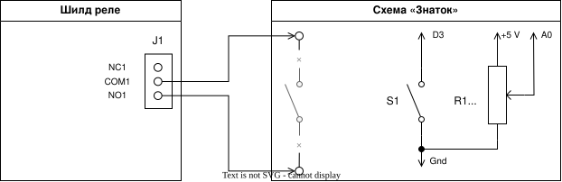

# Реле времени: выбираем время потенциометром

Теперь реле сможет работать не только 10 секунд. Передвинь ползунок потенциометра, нажми кнопку — и схема «Знаток» будет получать питание от 5 до 120 секунд. 🔘⏰

> **Важно:** используй только батарейные схемы конструктора «Знаток». Не подключай к реле розетку, лампы на 220 В и другие сетевые устройства.

## Что нам понадобится

- Arduino Leonardo;
- USB-кабель;
- компьютер с PlatformIO;
- шилд **Relay Shield v1.0 (12/02/2013)** с 4 реле;
- кнопка без фиксации;
- потенциометр;
- провода;
- батарейная схема конструктора «Знаток», подключённая через первое реле.

## Собери свою схему!

Собери реле и кнопку так же, как в [уроке 05](../05.%20Timer/README.md). Реле первого канала подключено к пину **D7**, а кнопка — к пину **D3**.

Добавь потенциометр:

1. Подключи один крайний контакт потенциометра к **5V** Arduino.
2. Подключи другой крайний контакт к **GND** Arduino.
3. Подключи средний контакт, то есть ползунок, к пину **A0** Arduino.



## Какие классы работают в программе

Мы используем готовые классы из предыдущих уроков и добавляем один новый метод.

- `Relay` из урока 04 включает и выключает первое реле.
- `Button` из урока 05 замечает новое нажатие кнопки.
- `Timer` из урока 05 отсчитывает время. Мы добавим ему метод `setInterval()`.
- `Potentiometer` из урока 03 читает положение ползунка и возвращает выбранное число секунд.

## Кнопка запускает реле на выбранное время

### Что здесь происходит

Ползунок выбирает время от 5 до 120 секунд. Когда ты нажимаешь кнопку, Arduino запоминает выбранное время, включает реле и запускает таймер. Пока таймер работает, положение ползунка можно менять, но время текущего запуска не изменится.

### Как реализовать

#### Шаг 1: Дополни главный план в `loop()`

В `main.cpp` уже есть готовая часть алгоритма из урока 05. Она проверяет, работает ли таймер, закончился ли он, и была ли нажата кнопка.

Внутри блока `if (button.wasPressed())` добавь код вместо трёх комментариев. Сначала получи время в секундах методом `potentiometer.getPosition()`. Затем переведи секунды в миллисекунды, умножив их на `millisecondsInSecond`. Наконец, передай получившееся время таймеру методом `timer.setInterval()`.

После этих строк оставь уже готовые команды `relay.on()` и `timer.restart()`: они включат питание и начнут отсчёт.

#### Шаг 2: Напиши `Timer.setInterval()`

Этот метод получает новую длительность в миллисекундах и запоминает её для следующего запуска таймера:

```cpp
void setInterval(unsigned long timerInterval) {
    interval = timerInterval;
}
```

Класс `Potentiometer` уже полностью готов: это класс из урока 03. Его метод `getPosition()` возвращает число от `minimumIntervalSeconds` до `maximumIntervalSeconds`.

## Запуск программы

1. Дополни код в `loop()` и метод `setInterval()`.
2. Сохрани `src/main.cpp`.
3. Подключи Arduino к компьютеру через USB.
4. Открой терминал в папке `06. Adjustable Timer` и введи:

```bash
platformio run --target upload
```

Передвинь ползунок, нажми кнопку и наблюдай за схемой. Реле включится, а после выбранного времени выключит питание. 🎉

## Экспериментируй!

Измени границы времени в константах в начале программы:

```cpp
const int minimumIntervalSeconds = 5;
const int maximumIntervalSeconds = 120;
```

Например, можно выбрать диапазон от 10 до 60 секунд:

```cpp
const int minimumIntervalSeconds = 10;
const int maximumIntervalSeconds = 60;
```

## Словарик

- **Потенциометр** — деталь с ползунком, которая позволяет выбрать значение.
- **Аналоговый пин** — пин, который умеет читать не только «включено» или «выключено», но и промежуточные значения.
- **A0** — аналоговый пин Arduino для подключения ползунка потенциометра.
- **`analogRead()`** — команда, которая читает положение потенциометра числом от 0 до 1023.
- **`map()`** — команда, которая переводит число из одного диапазона в другой.
- **Интервал** — выбранное время работы реле.
- **Миллисекунда** — одна тысячная секунды; 1000 миллисекунд — это 1 секунда.
- **`setInterval()`** — метод, который меняет длительность следующего отсчёта таймера.
- **`return`** — команда, которая сразу завершает текущий запуск функции.
