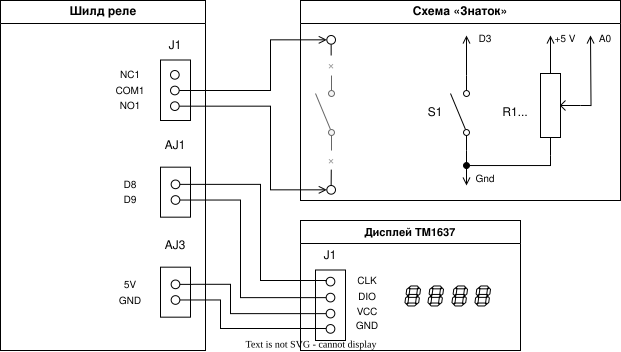

# Реле времени с цифровым дисплеем

Теперь реле времени покажет тебе, сколько времени осталось. На четырёхразрядном дисплее ты увидишь минуты и секунды. Пока таймер не запущен, дисплей показывает выбранное время, а после нажатия кнопки идёт обратный отсчёт. ⏱️✨

> **Важно:** используй только батарейные схемы конструктора «Знаток». Не подключай к реле розетку, лампы на 220 В и другие сетевые устройства.

## Что нам понадобится

- Arduino Leonardo;
- USB-кабель;
- компьютер с PlatformIO;
- шилд **Relay Shield v1.0 (12/02/2013)** с 4 реле;
- кнопка без фиксации;
- потенциометр;
- четырёхразрядный дисплей с драйвером **TM1637**;
- провода;
- батарейная схема конструктора «Знаток», подключённая через первое реле.

## Собери свою схему!

Собери схему так же, как в [уроке 06](../06.%20Adjustable%20Timer/README.md). Реле подключено к пину **D7**, кнопка — к **D3**, потенциометр — к **A0**.

Теперь добавь четырёхразрядный дисплей:

| Контакт дисплея | Куда подключить на Arduino Leonardo |
| --- | --- |
| `CLK` | пин **D8** |
| `DIO` | пин **D9** |
| `VCC` | **5V** |
| `GND` | **GND** |



## Какие классы работают в программе

Мы используем готовые классы из предыдущих уроков и добавляем два новых класса.

- `Relay` из урока 04 включает и выключает первое реле.
- `Button` из урока 05 замечает новое нажатие кнопки.
- `Timer` из урока 05 отсчитывает время. Мы добавим ему метод `getRemainingMilliseconds()`.
- `Potentiometer` из урока 03 читает положение ползунка и возвращает выбранное число секунд.
- `TimeDisplay` — новый класс для работы с дисплеем TM1637. Он умеет показывать минуты и секунды.
- `TimeView` — новый класс, который переводит миллисекунды в минуты и секунды и просит `TimeDisplay` показать их на дисплее.

## Обратный отсчёт на дисплее

### Что здесь происходит

Программа работает так же, как в уроке 06, но теперь на дисплее видно, сколько времени осталось. Пока таймер не запущен, дисплей показывает выбранное потенциометром время. После нажатия кнопки Arduino включает реле и на дисплее начинается обратный отсчёт. Когда время истечёт, реле выключается и на дисплее снова появляется выбранное время.

### Как реализовать

#### Шаг 1: Напиши главный алгоритм в `loop()`

В `loop()` уже есть готовая структура из урока 06. Тебе нужно самостоятельно дополнить те места, где стоят комментарии `TODO`. Ориентируйся на эти комментарии и на логику работы программы.

Когда таймер работает, нужно получить оставшееся время и показать его на дисплее. Когда таймер закончился, нужно выключить реле, остановить таймер и показать выбранное время на дисплее. Код для случая, когда кнопка нажата, уже готов.

#### Шаг 2: Добавь метод `Timer.getRemainingMilliseconds()`

Класс `Timer` умеет проверять, работает ли таймер и закончился ли он. Но чтобы показать оставшееся время на дисплее, нужен новый метод.

Напиши метод `getRemainingMilliseconds()` в классе `Timer`. Он должен возвращать оставшееся время в миллисекундах:

```cpp
unsigned long getRemainingMilliseconds() {
    if (!started) {
        return 0;
    }

    unsigned long elapsed = millis() - startTime;

    if (elapsed >= interval) {
        return 0;
    }

    return interval - elapsed;
}
```

Если таймер не запущен или уже закончился, метод возвращает `0`. Иначе он вычитает прошедшее время (`elapsed`) из полного интервала (`interval`) и возвращает остаток.

#### Шаг 3: Напиши класс `TimeDisplay`

Класс `TimeDisplay` работает с библиотекой `TM1637Display` и умеет показывать минуты и секунды отдельно. У него два метода: `setMinutes()` и `setSeconds()`.

**Метод `setMinutes(int minutes)`**

Этот метод показывает минуты в левых двух разрядах дисплея. Двоеточие между разрядами тоже включается здесь.

```cpp
void setMinutes(int minutes) {
    display.showNumberDecEx(minutes, colonBit, true, 2, 0);
}
```

Параметры метода `showNumberDecEx()`:
- `minutes` — число для показа;
- `colonBit` — битовая маска для включения двоеточия между разрядами;
- `true` — показывать ведущие нули (например, `05` вместо `_5`);
- `2` — количество разрядов для числа;
- `0` — позиция: начинаем с левого края дисплея.

**Метод `setSeconds(int seconds)`**

Этот метод показывает секунды в правых двух разрядах.

```cpp
void setSeconds(int seconds) {
    display.showNumberDecEx(seconds, 0x00, true, 2, 2);
}
```

Параметры:
- `seconds` — число для показа;
- `0x00` — маска без двоеточия;
- `true` — показывать ведущие нули;
- `2` — количество разрядов;
- `2` — позиция: начинаем с третьего разряда (индекс 2).

#### Шаг 4: Напиши класс `TimeView`

Класс `TimeView` получает время в миллисекундах, переводит его в минуты и секунды и передаёт их в `TimeDisplay`.

**Метод `setTimeInMilliseconds(unsigned long time)`**

Это публичный метод, который будет вызываться из `loop()`. Он запоминает время и сразу обновляет дисплей:

```cpp
void setTimeInMilliseconds(unsigned long time) {
    timeInMilliseconds = time;
    updateDisplay();
}
```

**Закрытый метод `updateDisplay()`**

Этот метод переводит время в минуты и секунды и просит `TimeDisplay` показать их:

```cpp
void updateDisplay() {
    int minutes = getMinutes();
    int seconds = getSeconds();

    display->setMinutes(minutes);
    display->setSeconds(seconds);
}
```

**Закрытый метод `getMinutes()`**

Переводит миллисекунды в минуты. Сначала делим на 1000, чтобы получить секунды. Потом делим на 60, чтобы получить минуты. Затем берём остаток от деления на 100, чтобы отбросить часы (если время больше 100 минут):

```cpp
int getMinutes() {
    unsigned long totalSeconds = timeInMilliseconds / 1000;
    unsigned long totalMinutes = totalSeconds / 60;
    return totalMinutes % 100;
}
```

**Закрытый метод `getSeconds()`**

Переводит миллисекунды в секунды и берёт остаток от деления на 60. Так мы получаем секунды, которые остались после полных минут:

```cpp
int getSeconds() {
    unsigned long totalSeconds = timeInMilliseconds / 1000;
    return totalSeconds % 60;
}
```

Например, если `timeInMilliseconds = 125000` (то есть 125 секунд):
- `totalSeconds = 125`;
- `totalMinutes = 2` (125 делим на 60);
- `getMinutes()` вернёт `2`;
- `getSeconds()` вернёт `5` (125 минус 120).

На дисплее появится `02:05`.

## Запуск программы

1. Напиши реализацию `loop()`, руководствуясь комментариями в коде.
2. Реализуй методы классов `Timer`, `TimeDisplay` и `TimeView`.
3. Сохрани `src/main.cpp`.
4. Подключи Arduino к компьютеру через USB.
5. Открой терминал в папке `08. Timer Display` и введи:

```bash
platformio run --target upload
```

Передвинь ползунок потенциометра — на дисплее появятся минуты и секунды. Нажми кнопку — реле включится, и на дисплее начнётся обратный отсчёт. Когда время истечёт, реле выключится. 🎉

## Экспериментируй!

### Измени диапазон времени

Попробуй изменить диапазон времени в константах в начале программы:

```cpp
const int minimumIntervalSeconds = 5;
const int maximumIntervalSeconds = 120;
```

Например, чтобы выбирать время от 1 до 10 минут:

```cpp
const int minimumIntervalSeconds = 60;
const int maximumIntervalSeconds = 600;
```

Теперь дисплей будет показывать до 10 минут вместо 2.

### Убери ноль перед числом минут

Сейчас дисплей таймера дополняет число минут и секунд нулем слева, если это число меньше 10.

```txt
02:08
```

В цифровых часах ты чаще видишь, что ноль добавляется только ко второму числу на дисплее. Вот так:

```txt
2:08
```

Постарайся самостоятельно сделать так, чтобы ведущий ноль добавлялся только к секундам, но не к минутам. Если нужно, внимательно перечитай пояснения к классу `TimeDisplay` — там есть подсказка, как этого добиться.

## Словарик

- **Обратный отсчёт** — время, которое уменьшается от заданного до нуля.
- **Оставшееся время** — время, которое ещё не прошло с момента запуска таймера.
- **Разряд** — одно место для цифры на дисплее. У этого дисплея четыре разряда.
- **Драйвер** — микросхема, которая управляет более сложным устройством и упрощает работу с ним. Драйвер дисплея получает команды от Arduino и сам зажигает нужные сегменты индикаторов.
- **TM1637** — драйвер на плате дисплея, который управляет индикаторами.
- **CLK** — провод, по которому Arduino задаёт ритм обмена с дисплеем.
- **DIO** — провод, по которому Arduino отправляет данные дисплею.
- **Двоеточие** — символ между минутами и секундами на дисплее.
- **Публичный метод** — метод класса, который можно вызывать из любого места программы. Объявляется в секции `public:`. Публичные методы образуют интерфейс класса — то, что класс предлагает для использования.
- **Закрытый метод** — метод класса, который можно вызывать только изнутри самого класса. Объявляется в секции `private:`. Закрытые методы помогают разбить сложную логику на части и скрыть детали реализации. А ещё программисты часто называют закрытые методы приватными.
- **`getRemainingMilliseconds()`** — метод класса `Timer`, который возвращает оставшееся время в миллисекундах.
- **`TimeDisplay`** — класс для работы с дисплеем TM1637. Умеет показывать минуты и секунды отдельно.
- **`TimeView`** — класс, который переводит миллисекунды в минуты и секунды и показывает их на дисплее.
- **`setTimeInMilliseconds()`** — метод класса `TimeView`, который получает время в миллисекундах и обновляет дисплей.
- **`showNumberDecEx()`** — метод библиотеки TM1637Display для показа чисел с дополнительным контролем двоеточия.
